# Authenticate using EntraID with Data API builder from Any JavaScript Client


## Prerequisites

- [AZ CLI](https://learn.microsoft.com/en-us/cli/azure/install-azure-cli?view=azure-cli-latest)
- [.NET 8](https://dotnet.microsoft.com/en-us/download/dotnet/8.0) 
- [VS Code](https://code.visualstudio.com/)
- [MSSQL](https://marketplace.visualstudio.com/items?itemName=ms-mssql.mssql) VS Code Extension
- [SQL Database Project](https://marketplace.visualstudio.com/items?itemName=ms-mssql.sql-database-projects-vscode) VS Code extension
- [Live Preview](https://marketplace.visualstudio.com/items?itemName=ms-vscode.live-server)
- [REST Client for Visual Studio Code](https://marketplace.visualstudio.com/items?itemName=humao.rest-client)

## Deploy the database


If you need a SQL Server database, you can use the free SQL Server Developer Edition or the [Azure SQL Free option](https://learn.microsoft.com/en-us/azure/azure-sql/database/free-offer?view=azuresql).
The easiest way to get started is by using the Docker container for SQL Server. You can find instructions in the [Local SQL Server container](https://learn.microsoft.com/en-us/sql/tools/visual-studio-code-extensions/mssql/mssql-local-container?view=sql-server-ver17) documentation.

This README assumes you are using the local SQL Server container for development.


Using the SQL Database Projects extension in VS Code, you can build and publish the database project in `./db/dab_entraid`:

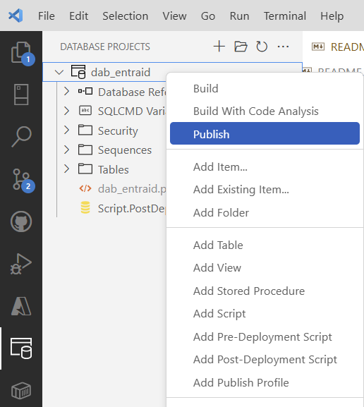

then select "Publish to a new SQL Server local development container". Use the proposed default port number 1433 and then enter a strong Admin password and confirm it. Accept the Microsoft SQL Server License Agreement and use the "latest" image from the proposed list. Then select "Don't use profile" and specify `dab_entraid` as the database name.

The database deployment will start, and in a few seconds you'll have the database deployed in a new running SQL Server container:

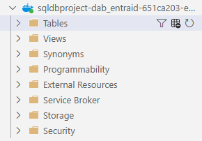

## Install and test Data API builder


> [!IMPORTANT]
> This README uses a pre-made Data API builder configuration file, available in the `./config` directory. If you want to create the configuration file from scratch, please follow the instructions in the [`./README-DAB.md`](./README-DAB.md) file.


Create a `.env` file in the root of the project by copying the `.env.sample` file. The sample file is already configured to work with the development environment, so unless you want to change something (for example, connect to a different server or database), you can leave it as is.


Open the terminal and run:

```bash
dotnet tool install Microsoft.DataApibuilder -g
```


to install Data API builder, then

```
dab start -c config/dab-config-noauth.json --no-https-redirect
```

to run Data API builder. The provided configuration exposes the tables

- `web.speakers`
- `web.sessions`


as REST and GraphQL endpoints, allowing access to anyone, with no need for authentication or authorization.


Right-click on the `index.html` file and select "Open with Live Server" to start the application. The simple HTML app uses GraphQL to query the database via the exposed GraphQL endpoint.


Since there is no authentication or authorization configured, anyone can access the data. As a result, all the sessions stored in the database are returned and displayed by the HTML page.

## Add authentication via EntraID

### Register the Data API builder application


Open the Azure Portal and search for "Entra ID"

()

and then open the Entra ID blade. 

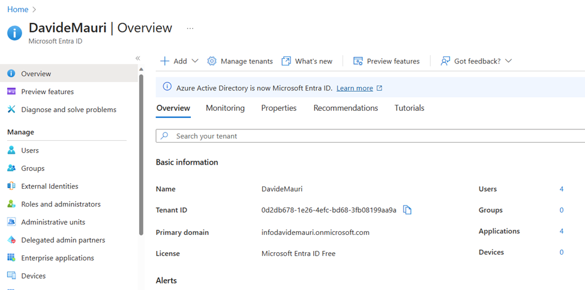

Go to App Registrations and click on "New Registration"


Name it "Data API builder" and select the most appropriate account type for you. For this example, we'll use "Accounts in this organization only". 

Click "Register" and then copy the generated "Application (client) ID".


into the Data API builder configuration file. Use the `./config/dab-config-auth.json` file and change it so that the `authentication` section looks like the following (your "Application (client) ID" will be different from the one shown below and in the pictures, which are used just as examples):

```json
"authentication": {
    "provider": "EntraID",
    "jwt": {
        "issuer": "",
        "audience": " 33d3ffac-ed9a-4fbe-b79f-5bc96713e860"
    }
}
```

Now identify the "Directory (tenant) ID" value


and add it in the form of

`https://login.microsoftonline.com/<tenant-id>/v2.0`

to the configuration file

```json
"authentication": {
    "provider": "EntraID",
    "jwt": {
        "issuer": "https://login.microsoftonline.com/36a71206-0015-4845-a10b-02a03ed530bd/v2.0",
        "audience": "33d3ffac-ed9a-4fbe-b79f-5bc96713e860"
    }
},
```

Now click on "Expose an API" and then "Add a Scope":

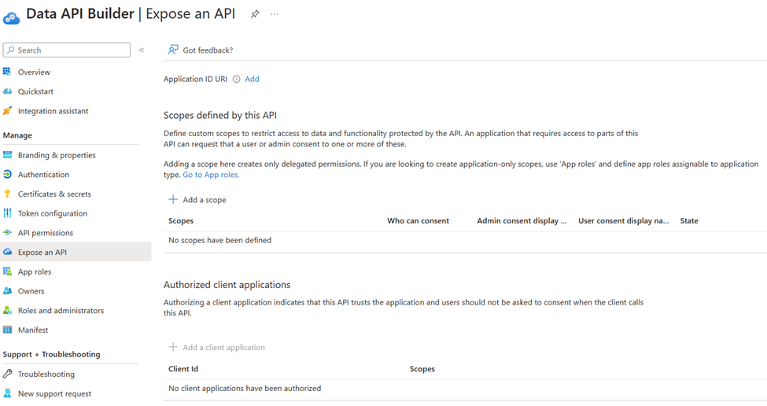

Accept the provided Application ID Uri and click on "Save and continue".

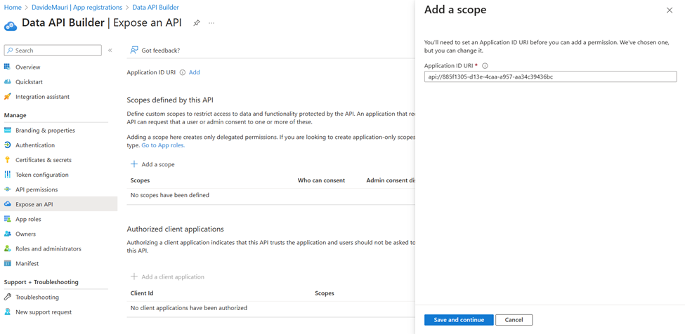


Create a scope named `Endpoints.Access`. Allow Admins and/or Users to consent depending on the security level you want to set.


Get the "Scope ID" as it will be needed later:


Now select the "Manifest" item from the left menu, and update the provided JSON so that version 2 of the access token is used. Find the `requestedAccessTokenVersion` in the `api` object and, if not already present or set to `2`, add or update it so that it looks like the following:

```json
"requestedAccessTokenVersion": 2,
```

## Configure Data API builder permissions


Now Data API builder is able to authenticate users via Entra ID. A sample of the authorization options that Data API builder allows is available in the `./config/dab-config-auth.json` file.


The "Session" entity has been configured to allow only `authenticated` requests. The values returned are only those that match the user's identity by comparing the value of the claim `oid` to the value of the column `owner`.

```json
"permissions": [
    {
        "role": "authenticated",
        "actions": [{
            "action": "read",
            "policy": {
                "database": "@claims.oid eq @item.owner"
            }
        }]
    }
],
```


If you have set your Entra ID application to have App Roles, as shown in the following screenshot, for example:

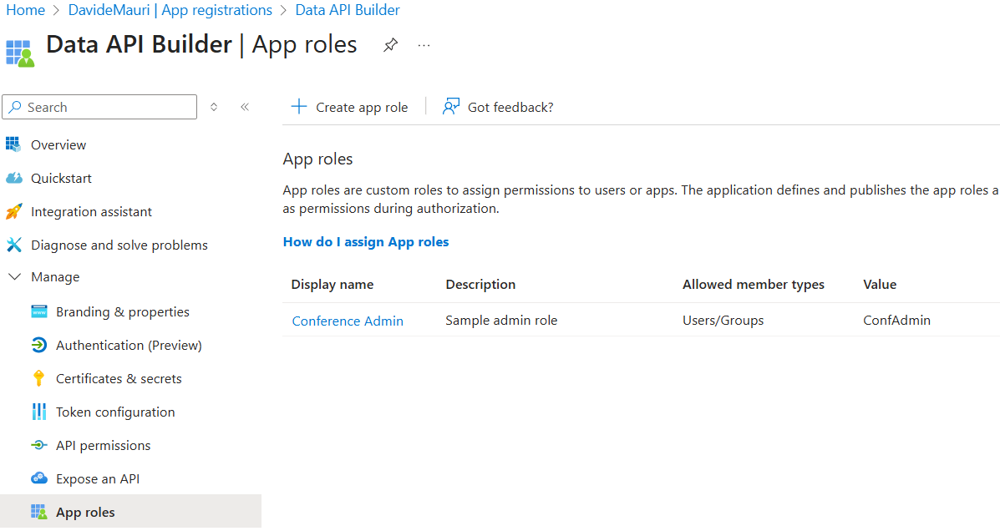


and you have associated a user with a role,


you can then use that role to have even more granular control over who can access your API endpoints. In the following example, users in the `ConfAdmin` role will be able to perform any CRUD action on the `Session` endpoint:

```json
"permissions": [
    {
        "role": "authenticated",
        "actions": [{
            "action": "read",
            "policy": {
                "database": "@claims.oid eq @item.owner"
            }
        }]
    },
    {
        "role": "ConfAdmin",
        "actions": [ "*" ]
    }
],
```

## Test Entra ID authorization


Make sure you log in and have access to the created scope in your tenant (replace "<Scope ID>" and "<Tenant ID>" with the values you retrieved in the previous steps):

```
az login --scope "<Scope ID>" --tenant "<Tenant ID>"
```

Then get the access token:

```
az account get-access-token  --scope "<Scope ID>" --tenant "<Tenant ID>"
```

You'll get an access token that you can use to authenticate your requests to the Data API builder.


Decode the token by passing the value of the `accessToken` property returned by the previous command to a JWT decoder tool like http://jwt.ms.


If your user also has a role assigned, you'll see it in the `roles` section:

```json
  "name": "Davide Mauri",
  "oid": "...",
  "preferred_username": "...",
  "rh": "...",
  "roles": [
    "ConfAdmin"
  ],
  "scp": "Endpoints.Access",
```


Get the value of the `oid` claim from the decoded token and run the `./db/update-owner.sql` script to update the owner of the session, replacing `OBJECT_ID` with the value you just obtained.


The update script will set the user identified by the `oid` as the owner of the session.

Now you can run Data API builder with the following command:

```bash
dab start -c config/dab-config-auth.json --no-https-redirect
```

to load the configuration and start the API builder. You should see output indicating that the API builder is running and ready to accept requests. Data API builder now expect users to be authenticated in order to return data for the "Session" endpoint.

Create a `test-auth.http` file by copying the provided `test-auth.http.template` file. Open the `test-auth.http` file and send the GET request: you'll get a `401 Unauthorized` response as there is no bearer token included in the request.

Add the bearer token to the `@token` variable so that it will be added to the request headers, and send the request again.

Now send the request and you should get a `200 OK` response with the session data that you own, as the owner of the session was set to the user identified by the `oid` claim in the access token.

If your Entra ID app has also been configured to have the `ConfAdmin` role, you can use it to perform administrative tasks on the API by sending requests with the `X-MS-API-ROLE` header set to `ConfAdmin` as follows:

```
GET http://localhost:5000/api/sessions
Authorization: Bearer {{token}}
X-MS-API-ROLE: ConfAdmin
```


All sessions will be returned regardless of the owner.

## Register the Client HTML Application


Now that authentication works, we want to make sure that the client HTML authentication is properly configured for our client application so that there is no need to use `az` to generate the token.


Go back to the Azure Portal, Entra ID blade, select "App Registration", and again click on "New Registration", Select the most appropriate account type; for this sample, you can use "Accounts in this organizational directory only (Personal only - Single tenant)", then specify the redirect URI as http://localhost:5500 and select "Single-page application (SPA)" as the platform:

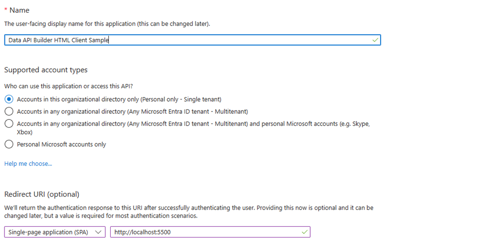

Click "Register". Take the "Application (client) ID":


and add it to the `authConfig.js` file:

```javascript
var authConfig = {
    clientId: "41e8bb4d-7ff6-437a-8740-2dfd598dcf2b",
    authority: "",
}
```

Get the “Directory (tenant) ID” and add it to the same file using the format:

```
https://login.microsoftonline.com/<tenant-id> 
```

For example:

```javascript
var authConfig = {
    clientId: "41e8bb4d-7ff6-437a-8740-2dfd598dcf2b",
    authority: "https://login.microsoftonline.com/36a71206-0015-4845-a10b-02a03ed530bd",
}
```


Back in the Azure Portal, click on “Authentication” and make sure that both Access and ID tokens are selected:

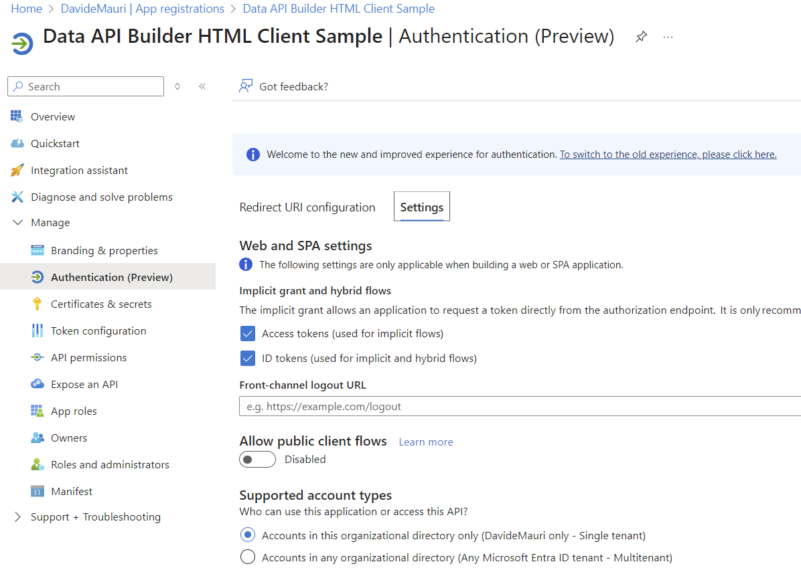

## Allow the client to call the Data API builder API

Go back to the "Entra ID" blade and select "App Registrations". Choose "Data API builder".

Click on "Expose an API" and then "Add a client application". Paste the "Application (client) ID" obtained earlier (for the HTML client application) and select the Endpoint.Access scope:

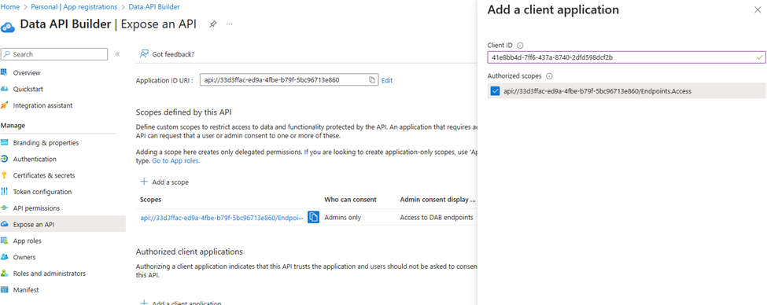 

Once done, click again on "Add application". Copy the scope visible under the "Scopes" section and add it to the `authConfig.js` file:

```javascript
var authConfig = {
    clientId: "41e8bb4d-7ff6-437a-8740-2dfd598dcf2b",
    authority: "https://login.microsoftonline.com/36a71206-0015-4845-a10b-02a03ed530bd",
}

var requestScopes = [
    "api://33d3ffac-ed9a-4fbe-b79f-5bc96713e860/Endpoints.Access"
]
```

## Test Entra ID authentication with the HTML client application


Make sure that you have Data API builder running with the correct configuration file:

```bash
dab start -c config/dab-config-auth.json --no-https-redirect
```

Now open the `index.html` with Live Server:

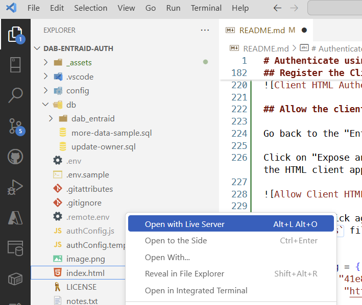

The browser will show the following page:

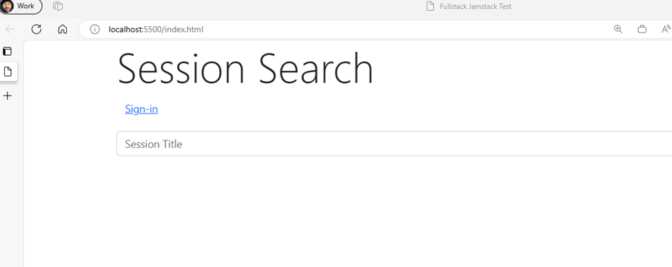

Click on "Sign In".

You'll see the Entra ID authentication window so you can log in using your credentials. Log in. The first time, the login popup might appear again, this time to inform you that your data will be passed to Data API builder. Accept.

You should not see any errors in the Data API builder log:

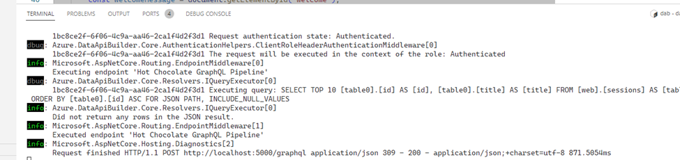


Now only one session is visible—the one you updated before and assigned to yourself:

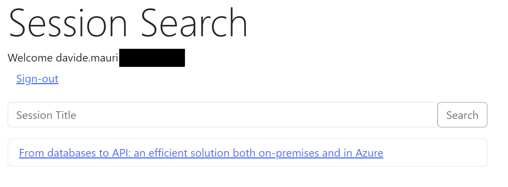


Congratulations, Entra ID authentication is now working with your client application and Data API builder!
